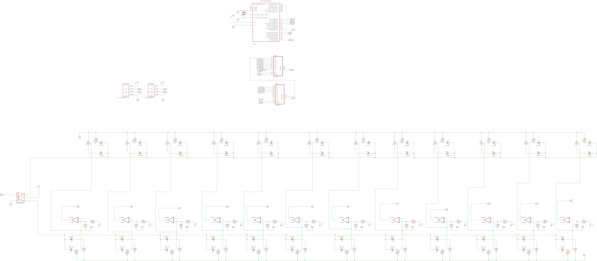

# Roboken Sensors

An array of Infrared Sensors that help the robot move along a line. 

## Principle of working

The line follower sensors have the capability to detect a white line on a dark background depending on the contrast. They estimate whether the line underneath them is shifting towards the left or right as they move over them. Based on the estimation, they give respective signals to the motors to turn left or right so as to maintain a steady center with respect to the line.

These robots usually use an array of Infrared sensors in order to calculate the reflectance of the surface beneath them. The basic criteria being that the black surface will have a lesser reflectance value (black will absorb light), than the light surface which is the line.

This low reflectance value is the parameter that is used to detect the position of the line by the robot. The lower the value of reflectance will be the around the line. So in this linear array of IR sensors, if the leftmost or rightmost Infrared sensors presents the high value of reflectance, then the black line is towards the left or right of the robot respectively. The controller then compensates for this by signalling the motor to go in the opposite direction of the line. 

The Infrared Sensor consists of individual Infrared Led's and Infrared photodiodes. The Infrared light emitted by the LED strikes the surface and is reflected back to the Infrared Photodiode. The photodiode then gives an output voltage proportional to the reflectance of the surface (high value for a light surface and low for black/dark surface)

	

## Circuit Design

The circuit is set up as following. Circuit was designed by [eagle cad](https://www.autodesk.com/products/eagle/overview)

	

## Inventory

Quantitiy of resistors, strip/vero board are double the amount needed in the circuit

| Item          | Quantity      | Price (Ksh) | Total Cost | Supplier | Link |
| ------------- |---------------| ------|------------|----------|------|
| Infrared Receiver IR Transmitter Pair | 12 | 20.00 | 240.00 | Ktechnics  | https://ktechnics.com/shop/infrared-receiver-transmitter-pair/ |
| HC-SR04 Ultrasonic Sensor | 2 | 200.00 | 400.00 | Ktechnics  | https://ktechnics.com/shop/hc-sr04-ultrasonic-sensor/ |
| LM358N Low Power Dual Op-Amp IC | 6 | 150.00 | 900.00 | Ktechnics  | https://ktechnics.com/shop/lm358n-low-power-dual-op-amp-ic/ |
| 8 PIN DIP IC SOCKET | 6 | 10.00 | 60.00 | Ktechnics  | https://ktechnics.com/shop/8-pin-dip-ic-socket/ |
| Strip/Vero board | 4 | 50.00 | 200.00 | Ktechnics  | https://ktechnics.com/shop/stripvero-board/ |
| 4.7 Killo ohm resistor | 24 | 3.00 | 72.00 | Ktechnics  | https://ktechnics.com/shop/resistors/ |
| 100 Ohm resistor | 12 | 3.00 | 36.00 | Ktechnics  | https://ktechnics.com/shop/resistors/ |
| 100 Killo ohm resistor | 12 | 3.00 | 36.00 | Ktechnics  | https://ktechnics.com/shop/resistors/ |
| Total | 944.00 Ksh |

## References

http://www.instructables.com/id/DIY-Line-Follower-Sensor-Array/

https://diyhacking.com/make-line-follower-robot/
